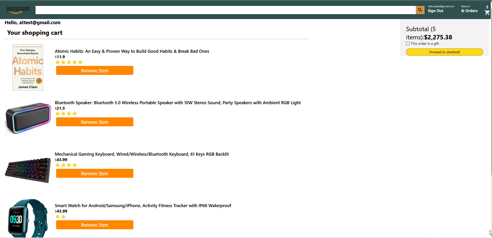

# Checkout the website demo : https://clozon-fc92d.web.app/

# Front-End: 
### I used react components for their re-usability to populate page content. 

### Navigation: 
#### I used react router to handle in-website navigation. The feature of having all components loaded is if it's a one-page website impressive. The website loads different pages at once.

# Back-End:

### Firebase Authentication: 
#### I was able to let users create user accounts and login / logout. 

### Firestore database: 
#### Used for storing account details such as order history and current cart items.

### Stripe API: used to process payements and confirm transactions. 

